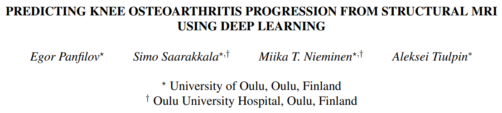
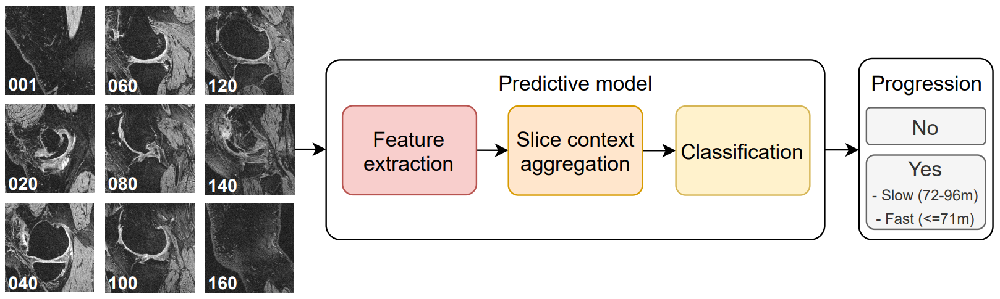

# oaprmr - Osteoarthritis Progression Prediction from MR data

Source code accompanying ISBI 2022 publication, https://arxiv.org/abs/2201.10849:

<p align="center">
 
</p>

<p align="center">
 
</p>

### Description

1. The code requires the OAI Baseline/00m dataset - textual variables and SAG 3D DESS MR
 images.

2. Create a Conda environment from `environment.yml`. Install the code as a Python module.

3. See `entry/runner.sh` for the complete workflow.
 
4. The structure of the original project is as follows:
    ```
    ./project/
      | data/  # preprocessed scans and variables
        | OAI_Clin_prep/
          | meta_base.csv
        | OAI_SAG_3D_DESS_prep/
        | OAI_XR_PA_prep/
      | src/ (this repository)
      | results/  # model weights, intermediate and final results 
        | experiment_0/
          | weights/
          | ...
        | experiment_1/
        | ...
    ```

### Legal aspects

This code is freely available for research purposes.

The software has not been certified as a medical device and, therefore, must not be used
for diagnostic purposes in a real clinical scenario.

### Cite this work

```
@inproceedings{panfilov2022predicting,
  title={Predicting Knee Osteoarthritis Progression from Structural {MRI} Using Deep Learning},
  author={Panfilov, Egor and Saarakkala, Simo and Nieminen, Miika T and Tiulpin, Aleksei},
  booktitle={2022 IEEE 19th International Symposium on Biomedical Imaging (ISBI)},
  pages={1--5},
  year={2022},
  organization={IEEE}
}
```
